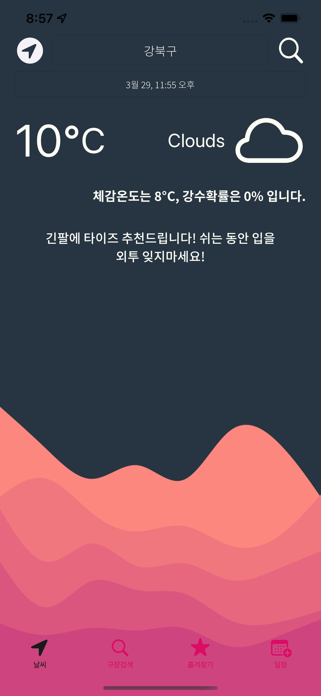
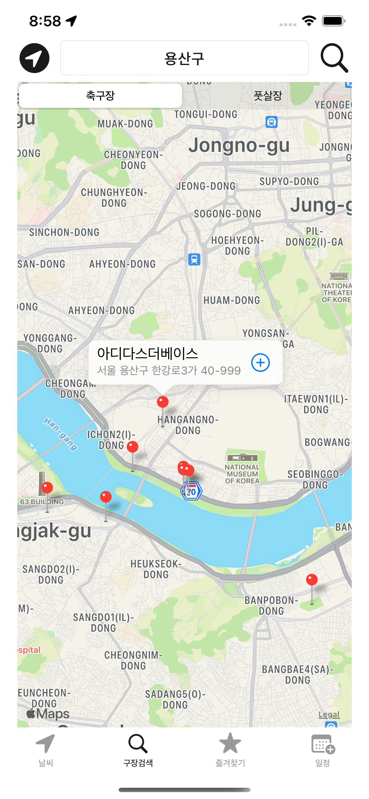
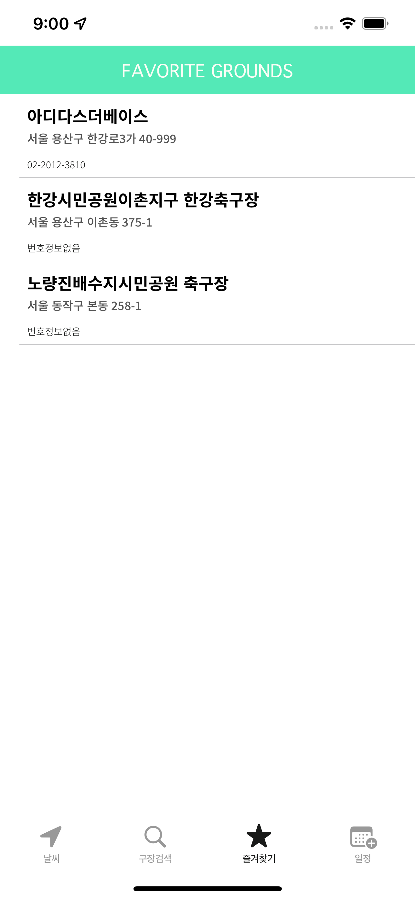
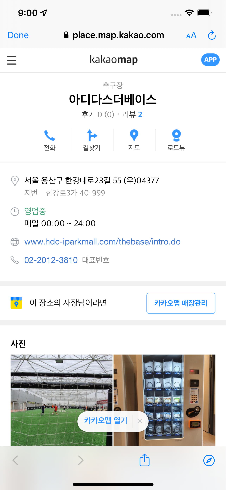
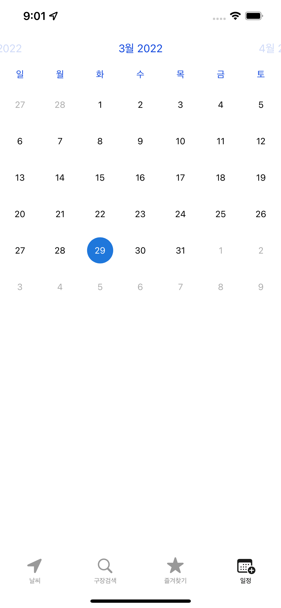
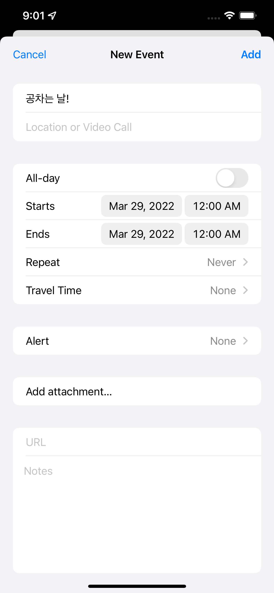

# CanISoccer  ->  [앱스토어 링크](https://apps.apple.com/kr/app/canisoccer/id1596845566)

#### 주요기능
- 날씨 API를 이용하여 예정된 경기 시간의 일기예보를 보여줍니다
- 날씨에 맞는 축구 용품을 사용자에게 추천해줍니다.
- 내 주변 축구장 및 풋살장을 검색할 수 있고 즐겨찾기 기능을 통해 자주가는 경기장을 저장할 수 있습니다.
- 즐겨찾기된 경기장을 클릭하면 Kakaomap을 통해 경기장에 대한 상세정보를 조회할 수 있습니다. 
- 내 경기일정을 캘린더에 저장할 수 있는 기능이 있습니다.

#### 기술
- Swift5
- AutoLayout
- MVC Pattern
- RealmDB
- Alamofire
- FSCalendar
#### APIs
- OpenWeatherMap 
- Naver Geocoding
- Kakao 지역검색
--------
## 참고 스크린샷
>

-----
## 앱을 출시하며 느낀점
- 처음에는 기획부터 시작해 디자인까지 혼자 해야되서 막막했지만, 하나하나 차근차근 단계적으로 문제해결을 했고 결국에는 앱스토어에 출시가 되어 정말 기뻤다.
- api 사용법들이 다 달라 처음에는 어려웠지만, api문서들을 보고 적용하니 서버통신을 성공적으로 할 수 있었다. 가이드 문서의 중요성을 알게 되었다.
- 나만의 앱을 출시하게 되니 앱을 출시하는 과정이 어떤지 알게 되었고, 심사과정에서 리젝된 경험을 통해 앱개발자로써 한 단계 성장하게 된 계기가 된 것 같다.

