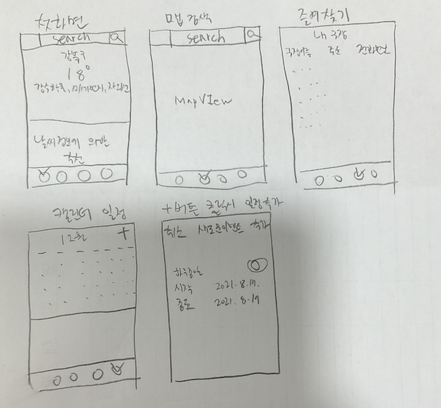

# 오늘 내가 한일
1.개발 공수계산

|업무|예상시간|실소요시간|예상시간 산정 이유|
|--|--|--|--|
|기획 및 디자인(폰트, 컬러, icon)|8|*|떠먹여주는 개발만 하다 디자인부터 하려니 감이 안옴|
|DB|4|*|내가 기획한 앱은 데이터베이스를 크게 쓰지 않을 것 같음|
|View / 화면전환|8|*|오토레이아웃 구성이 아직 미숙함|
|사용자 위치 정보 받아와서 날씨 보여주기|4|*|API 서버통신만 배운대로 하면 될 것 같아 짧은시간에 구현 가능하지 않을까..|
|주소를 검색 후 날씨 정보 받아오기|4|*|서버통신만 잘하면..|
|검색기능으로 주변 풋살장 or 축구장 맵에 표시하기|6|*|수업시간에 배웠던 걸 생각해서 하면 금방할 듯|
|맵뷰에서 검색된 결과를 즐겨찾기 하기|10|*|어떻게 해야 될지 감이 안옴|
|캘린더에 예정된 경기 일정 등록하기|10|*|어떻게 해야 될지 감이 안옴|
|등록된 일정에 따라 날씨 정보 알려주기|8|*|어떻게 해야 될지 감이 안옴|
|추천된 옷차림, 날씨, 용품 친구에게 공유|4|*|데이터만 있다면 공유는 쉬울 듯|
|디버깅|8|*|뭔지 잘 모르지만 일단 넣었음..|
|리팩토링(코드중복제거?)|6|*|extension을 먼저 학습하고 도전해야 하지 않을까..|
|합계|80|*|2주안에 가능할까요..? 일단 해봅시다|

-----
2.똥손으로 UI 스케치 해봄. 툴을 이용해 해보고 싶었는데 포기 

 
 
3.AppIcon Canva.com에서 만듦

 

4.다크모드 미지원 처리
 # 오늘 공부한 것
 
1. FireBase로 이메일 회원가입, 로그인, 로그아웃 기능구현 학습
2. Type Casting에 대해 복습
 # 오늘의 실수
 