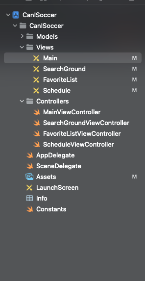

# 오늘 내가 한일
1. 출시 프로젝트 기획서 제출
    - 팀원들 기획서를 봤는데 엄청 자세하고 읽기 쉽게 작성이 되어있었다. 그에 반해 내가 작성한 기획서는 성의가 없어 보였다. 물론 기획서에 큰 시간을 쓰고싶지 않았서 큰 정성을 들이진 않았지만, 다음에는 좀더 자세하고 구체적으로 작성해봐야겠다.
2. Assets에 사용할 컬러 추가
    - [color Hunt](https://colorhunt.co/) 에서 맘에드는 색을 찾아 추가해보았다.
3. 기상예보 데이터를 받기위해 openweathermap의 api를 찾아보았다. 5일/3시간 예측 데이터 호출 api를 찾았는데 이 api를 호출하려면 좌표가 필요했다. 그래서 한글 주소를 좌표로 바꿀 수 있는 네이버의 map-geocode를 인섬니아에 추가했다.
4. 스토리보드와 뷰컨트롤러 파일을 만들어 탭바뷰컨트롤러로 화면 연결을 했다.
  

5. 메인뷰 컨트롤러 화면을 만들었다. 예쁘지가 않다..

  

# 오늘 공부한 것
1. 유데미에서 수강하고 있는 스위프트 강의를 마저 들었다. 
# 팀 빌딩
  - 각자 구상한 앱 디자인과 기능들을 소개했다.
# 오늘의 실수
 1. 메인뷰의 백그라운드 이미지를 찾느라 시간을 너무 많이 허비했다. 지금 당장 중요한 부분이 아닌데.. 업무 우선 순위를 잘 정하자.
 2. 예전에 썼던 openweathermap의 존재를 까먹고 공공데이터포털의 기상 단기예보 api기능 사용법을 익히느라 또 시간을 허비했다. Insomnia를 켜보고 깨달았다. api보관을 잘 하자!
 3. md파일 작성 후 저장을 자꾸 까먹는다. 작성 후 저장을 잘 하자!

 