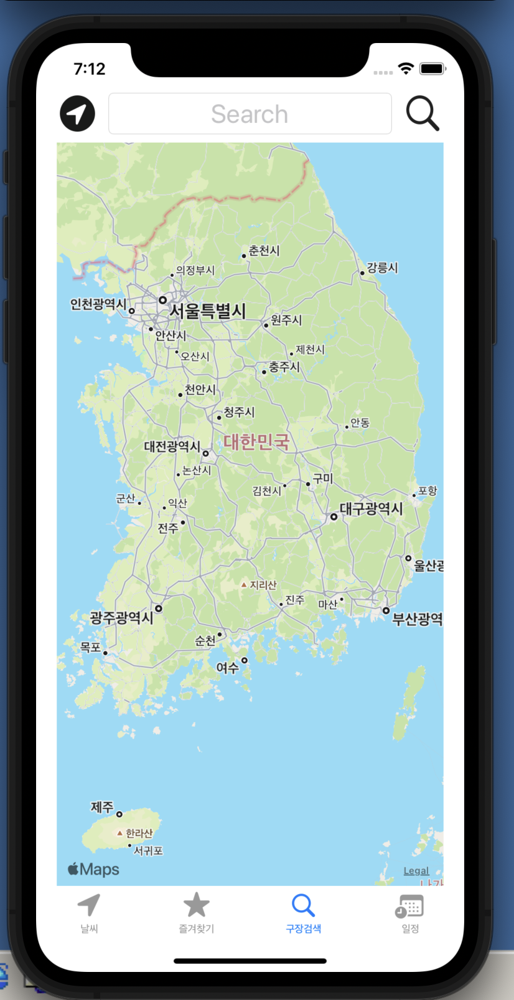
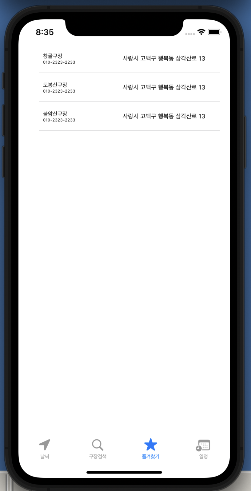

# 오늘 내가 한일
1. 디자인을 위한 여러가지 사이트들 찾아봄 
    - 하나 찾음 [https://haikei.app/](https://haikei.app/)

2. 구장검색 화면 구성

    

3. 즐겨찾기 화면 구성

    
# 오늘 공부한 것
1. 깃 리셋하는 방법 
2. cocoapods 초기화
3. 딕셔너리 다시 복습
# 팀 빌딩
  - 어제 한거 / 궁금한거 서로 물어봄
# 오늘의 실수
 1. 네이버맵을 쓰기 위해 Cocoapods으로 네이버맵 라이브러리를 설치했다. 그런데 용량이 너무 커서 내 앱에는 쓰기 힘들어 보였다. 그래서 다시 삭제하려고 했는데 삭제가 제대로 되지 않아 깃이 꼬여버렸다. 결국에는 해답을 못찾고 git reset hard로 오늘 작업을 시작했던 지점으로 다시 돌아왔다.
    - 라이브러리 설치전에 자세하게 알아보고 쓰자
    - 깃에 대한 학습도 주말간 해야겠다.